  
  
  
  
  
  

---

### `whoami`

AI Engineer and researcher (CSE @ BRAC University) working across computer vision, NLP, deep learning, and the production systems around them. I train and evaluate models end to end and report the honest ceiling, the failure modes matter as much as the headline number.

- Researching **biometric privacy under generative editing** (working paper in preparation).
- Shipping production platforms on a **zero-cost cloud budget**.
- Everything, interactive AI playground and a RAG assistant included, lives at **[imtiazhossain.dev](https://imtiazhossain.dev)**.
- Open to research collaborations, AI/ML engineering roles, and graduate opportunities.

---

### Featured work

| Project | What it is | Links |
| :-- | :-- | :-- |
| **Brain Tumor Segmentation**   | U-Net + DenseNet on the BRISC 2025 MRI dataset |   |
| **News Topic Classification**  | 27 experiments, TF-IDF through BERT |   |
| **AI-Text Detection**  | 28 stylometric features + Random Forest |   |
| **Working paper — biometric privacy**  | Multi-face biometric unlinkability under generative editing |  |
| **BRACU Vault** | Verified study archive on a $0/mo Cloudflare stack |  |
| **Polaris** | AI academic strategist — structured LLM output + RAG |   |

---

### Toolbox

**AI / ML**  

**Languages**  

**Web & Cloud**  

---

&nbsp;

  

  

---

---

<i>I build intelligent systems, and I show my work.</i>

